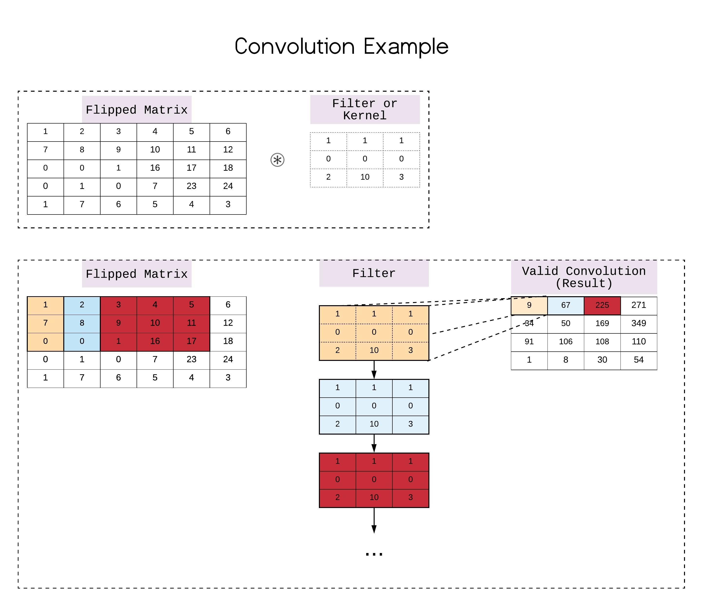

# Sesiones
En este archivo se describen las actividades por sesión que se llevaran a cabbo durante la semana.

### Explicación del estándar usado para evaluar
 (en caso de aplicar o ser diferente a los de github) (30 min)
[Guías de estilo para python.  (PEP 8)](https://www.python.org/dev/peps/pep-0008/)

[Guías de estilo para github   (Templates de los Commits en el proyecto).](https://medium.com/@nawarpianist/git-commit-best-practices-dab8d722de99)
Explicación de entrevista.

estándares para logs en repositorios:

[Git best practices 1](https://medium.com/@nawarpianist/git-commit-best-practices-dab8d722de99)

[Git best practices 2](https://deepsource.io/blog/git-best-practices/)

### ¿Qué es y para qué sirve el procesamiento de imágenes? (30 min)
* La visión computacional y el procesamiento de imágenes.
* Las imágenes son matrices de números

[source](https://becominghuman.ai/real-computer-vision-for-mobile-and-embedded-part-1-c04ea8b9fd26).
* Mostrar ejemplos de detectores. 

 
[source](https://docs.opencv.org/master/d5/d0f/tutorial_py_gradients.html)
* Lo que se espera al final de la semana: Proyecto Vision/sobel.py (requiere: pip install opencv-python) 
* Mostrar redes Convolutivas 
 

[source](https://becominghuman.ai/real-computer-vision-for-mobile-and-embedded-part-1-c04ea8b9fd26).

### ¿Que es una convolución?  (30 min)

y en una imagen real de 3 dimensiones:
[Conv animation by Andrej Karpathy](https://pathmind.com/wiki/convolutional-network) 

### Ejercicio acompañado convolución a mano  (30 min)
Hagamos una convolución a mano para entender mejor como funciona.
[Ejemplo de convolución](Files/examples%20convolution.xlsx)

### Explicación y Demo de Implementación de Convolución  (30 min)
Una convolución simplificada, poco eficiente, pero más entendible a continuación veremos el código paso a paso, descarlo y agrega comentarios.
[Convolution Simple.py](Scripts/Ejemplos/simple_conv.py)

### Implementación de convolución individual (60 min)
Basándote en el ejemplo mostrado en clase, implementa tu propia versión de una convolución. Tu función debe recibir 2 matrices: la imagen a modificar y el filtro, y debe devolver la matriz resultante de la operación.
Cuando tu programa esté funcionando, súbelo a tu repositorio de git (commit y push) y pega el link de tu repo en canvas en la actividad de implementación de convolución individual. Recuerda que tu código y commits deben de cumplir con todos lo estándares.   

### Búsqueda de Filtros (Innovación): (40 min)
La primera parte de un innovación radica en conocer qué es lo que se hace actualmente. Lo primero que debes hacer es investigar y encontrar que diferentes filtros usados para concoluciones y sus efectos en las imágenes. Buscar un par y comparalos con tu equipo e identifiquen cuál es el estándar que mejor complementa su proyecto. Incluye en el readme del proyecto los estándartes que buscaron, las fuentes de donde los sacaron y la esplicación de cual fue el que escogieron para implementar cada uno y porqué.
Aquí puedes comenzar tu búsqueda:
[Kernel for Copnvolutions](https://aishack.in/tutorials/image-convolution-examples/)

### Propuesta de Proyecto (Innovación): (20 min)
En equipo generen un repositorio para su proyecto, recuerden que cada quien tendrá que hacer su propia rama y después integrarlo con su repositorio prinicpal.
Siguiendo las buenas prácticas de github y python preparen el esqueleto de lo que será su proyecto y hagan la repartición del trabajo que le tocará a cada uno. Se espera que cada miembro del equipo generé sus porpios commits desde su cuenta personal y que integren el proyecto (merge branch) en un solo repositorio usando Git. Si no se tienen commits individuales y el merge, no tendrán evindencia suficiente para acreditar la semana. El objetivo es que no pierdan tiempo en el setup del proyecto en las siguientes sesiones.

### Setup de las herramientas y uso de opencv (60 min)
Explicación de código muestra para leer y generar imágenes, instalación de opencv con PIP (60 min)
1. Mostrar cómo instalar Opencv en python                          (pip install opencv-python)
2. Mostrar cómo se reciben los archivos corriendo el programa      (python sobel.py  --image imagen.jpg) 
3. Mostrar cómo se reciben los archivos dentro del cósigo          (args = vars(ap.parse_args()) 
4. Mostrar como se transforman las imágenes en números             (image = cv2.imread(args["image"])

### ¿Qué es el Padding?  (15 min)

Imagen de deeep learning using Caffe by Claud Greer

### Padding a mano acompañado   (15 min)
Archivo excel ejemplo padding

### Explicación y Demo de Implementación de Padding  (30 min)
[Convolución con padding](Scripts/Ejemplos/convolution.py)

### Implementación de Padding estudiantes individual acompañado por profesor  (60 min)
Basándote en el ejemplo mostrado en clase, implementa tu propia versión de una convolución. Tu función debe recibir la matriz y el tamaño que debe tener la matriz a rellenar, y debe devolver la matriz llena de ceros en la orilla.
Cuando tu programa esté funcionando, súbelo a tu repositorio de git y entrega pega el link de tu repo en canvas en la actividad de implementación de convolución individual. Recuerda que tu código y commits deben de cumplir con todos lo estándares.

### Mostrar Ejemplo de repositorio con buenas prácticas

